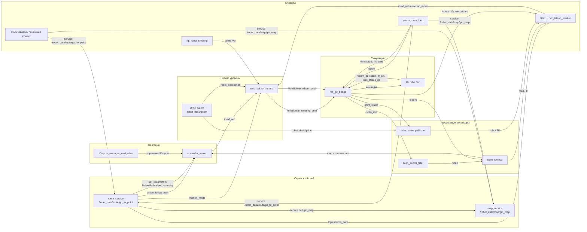

# ROS 2 Forklift Demo

Небольшой стенд на `ROS 2 Humble + Gazebo Sim + Nav2` для rear-steer погрузчика.

Система построена вокруг идеи "карта в виде графа точек и связей + сервис маршрута". Пользователь не публикует `Path` руками и не работает с координатами напрямую. Вместо этого он вызывает сервис, говорит "из точки X в точку Y, приехать front/rear", а дальше маршрут строится и исполняется автоматически.

## Из чего состоит система

Основные узлы:

- `map_service`
  Возвращает JSON-карту в формате `point/path`.

- `route_service`
  Принимает запрос "откуда -> куда -> как приехать", сам запрашивает карту, строит маршрут по графу и отправляет `FollowPath` в Nav2.

- `cmd_vel_to_motors`
  Низкоуровневый контроллер. Принимает `/cmd_vel` и `/motion_mode`, анализирует кинематику по URDF и публикует угол поворотного ведущего колеса и его угловую скорость в топики контроллеров Gazebo.

- `demo_route_loop`
  Демонстрационный узел. По умолчанию включен в launch, сам по кругу вызывает сервис маршрута и имитирует перевозку палеты между несколькими точками.

- `controller_server` из Nav2
  Исполняет уже готовый путь через `RegulatedPurePursuitController` и публикует `/cmd_vel`.

- `slam_toolbox`
  Публикует `map -> odom`.

- `ros_gz_bridge`
  Связывает Gazebo и ROS по времени, лидарам, одометрии, TF, joint states и управляющим топикам.

## Кто за что отвечает

### `/robot_data/map/get_map`

Сервис карты. Возвращает JSON с двумя массивами:

- `point`
  Описание точек карты: `point_id`, `alias`, координаты, метаданные.

- `path`
  Направленные связи между точками.

Источник данных: [map_data.py](/home/user/forklift_test/src/forklift_demo_control/forklift_demo_control/map_data.py)

Обработчик сервиса: [map_service.py](/home/user/forklift_test/src/forklift_demo_control/forklift_demo_control/map_service.py)

### `/robot_data/route/go_to_point`

Сервис маршрута. Принимает JSON примерно такого вида:

```json
{
  "start": "0001",
  "goal": "0004",
  "arrival_mode": "front"
}
```

`start` и `goal` можно передавать:

- по `alias`, например `"0001"`
- по `point_id`, например `2`

`arrival_mode` понимает:

- `front`, `forward`, `передом`
- `rear`, `reverse`, `backward`, `задом`

Обработчик сервиса: [route_service.py](/home/user/forklift_test/src/forklift_demo_control/forklift_demo_control/route_service.py)

## Что значит `front` и `rear`

В пользовательской логике:

- `front` = сторона поворотных колес
- `rear` = сторона вил и паразитных передних колес

Важно: внутри низкого уровня есть свои режимы `BODY_FIRST` и `FORKS_FIRST`. Это внутренняя кинематическая деталь, а не то, что должен помнить пользователь сервиса.

Текущее соответствие такое:

- пользовательский `front` мапится на внутренний `FORKS_FIRST`
- пользовательский `rear` мапится на внутренний `BODY_FIRST`

## Как строится маршрут

Алгоритм в [route_service.py](/home/user/forklift_test/src/forklift_demo_control/forklift_demo_control/route_service.py) в кратце такой:

1. Сервис принимает запрос `start / goal / arrival_mode`.
2. Запрашивает карту у `/robot_data/map/get_map`.
3. Индексирует точки:
   - по `point_id`
   - по `alias`
4. Разрешает `start` и `goal` в реальные точки карты.
5. Строит кратчайший путь по графу.
   Вес ребра = обычное евклидово расстояние между двумя точками.
6. Получает цепочку узлов, например `["0003", "0002", "0005"]`.
7. Превращает эту цепочку в ломаную, скругляет близкие к 90° углы радиусом 1 м и дополнительно "уплотняет" ее промежуточными точками, чтобы Nav2 вел робот не по редким вершинам, а по нормальному `Path`.
8. В зависимости от `arrival_mode` режет маршрут на сегменты:
   - `front`: весь маршрут одним сегментом
   - `rear`: весь маршрут, кроме последнего ребра, идет одним режимом; последний отрезок в цель идет отдельным сегментом другим режимом
   - если перед финальной точкой есть поворот примерно на 90°, front-сегмент продлевается еще на 1 м вперед, а финальный rear-сегмент строится дугой в точку
9. Перед отправкой каждого сегмента:
   - публикует `/motion_mode`
   - переключает параметр `FollowPath.allow_reversing` у `controller_server`
10. Отправляет сегмент в action `follow_path`.

Итог: пользователь всегда вызывает один сервис, а внутри маршрут может превратиться в 1 или 2 `FollowPath`-сегмента в зависимости от того, как нужно приехать в цель.

## Как исполняется `/cmd_vel`

Низкий уровень сейчас устроен так:

- Источники `cmd_vel`
  `controller_server`, `rqt_robot_steering`, [keyboard_teleop.py](/home/user/forklift_test/src/forklift_demo_control/forklift_demo_control/keyboard_teleop.py) и [rviz_teleop_marker.py](/home/user/forklift_test/src/forklift_demo_control/forklift_demo_control/rviz_teleop_marker.py) могут публиковать `/cmd_vel`.

- Источник `motion_mode`
  [route_service.py](/home/user/forklift_test/src/forklift_demo_control/forklift_demo_control/route_service.py), [keyboard_teleop.py](/home/user/forklift_test/src/forklift_demo_control/forklift_demo_control/keyboard_teleop.py) и [rviz_teleop_marker.py](/home/user/forklift_test/src/forklift_demo_control/forklift_demo_control/rviz_teleop_marker.py) публикуют `/motion_mode`.

- Низкоуровневое преобразование
  [cmd_vel_to_motors.py](/home/user/forklift_test/src/forklift_demo_control/forklift_demo_control/cmd_vel_to_motors.py) читает `robot_description` из URDF, извлекает положение `rear_steering_joint`, радиус `rear_wheel_joint` и позу `tracking_link`.

- Опорная точка команды
  `/cmd_vel` интерпретируется относительно `tracking_link`, расположенного между передними колесами под вилами, и Nav2 использует ту же опорную точку как `robot_base_frame`. Это важно, потому что ведущее колесо смещено в сторону и назад; без общей опорной точки левый и правый поворот дают разную мгновенную ось вращения.

- Режимы движения
  `BODY_FIRST` заставляет низкий уровень ехать в сторону корпуса. `FORKS_FIRST` заставляет ехать в сторону вил и дополнительно ограничивает скорость через `reverse_velocity_scale`, сохраняя кривизну команды.

- Выход низкого уровня
  `cmd_vel_to_motors` публикует:
  - `/forklift/rear_steering_cmd`
  - `/forklift/rear_wheel_cmd`

  Дальше эти топики через `ros_gz_bridge` попадают в Gazebo-контроллеры шарниров.

## Прямое управление рулем и скоростью

Если хочешь обойти `cmd_vel_to_motors` и управлять погрузчиком напрямую, можно публиковать команды сразу в два топика:

- `/forklift/rear_steering_cmd`
  Угол поворотного ведущего колеса в радианах.

- `/forklift/rear_wheel_cmd`
  Угловая скорость ведущего колеса в рад/с.

Примеры:

Повернуть колесо на `90°` вправо:

```bash
ros2 topic pub /forklift/rear_steering_cmd std_msgs/msg/Float64 "{data: 1.5708}" -r 10
```

Повернуть колесо на `90°` влево:

```bash
ros2 topic pub /forklift/rear_steering_cmd std_msgs/msg/Float64 "{data: -1.5708}" -r 10
```

Поставить колесо прямо:

```bash
ros2 topic pub /forklift/rear_steering_cmd std_msgs/msg/Float64 "{data: 0.0}" -r 10
```

Задать скорость ведущего колеса:

```bash
ros2 topic pub /forklift/rear_wheel_cmd std_msgs/msg/Float64 "{data: 2.0}" -r 10
```

Остановить ведущее колесо:

```bash
ros2 topic pub --once /forklift/rear_wheel_cmd std_msgs/msg/Float64 "{data: 0.0}"
```

Приблизительное соответствие угловой и линейной скорости при радиусе колеса `0.18 м`:

- `1.0 рад/с` ≈ `0.18 м/с`
- `2.0 рад/с` ≈ `0.36 м/с`
- `3.0 рад/с` ≈ `0.54 м/с`

Важно:

- текущий лимит угла руля `±90°`

## Текущая карта

Карта задается в [map_data.py](/home/user/forklift_test/src/forklift_demo_control/forklift_demo_control/map_data.py).

Точки:

- `0000` / `1`: `(-4.0, -4.0)`
- `0001` / `2`: `(-4.0, 4.0)`
- `0002` / `3`: `(0.0, 4.0)`
- `0003` / `4`: `(4.0, 4.0)`
- `0004` / `5`: `(4.0, -4.0)`
- `0005` / `6`: `(0.0, 1.0)`
- `0006` / `7`: `(-2.0, 1.0)`
- `0007` / `8`: `(-2.0, -4.0)`

Связи:

- `1 <-> 2`
- `2 <-> 3`
- `3 <-> 4`
- `4 <-> 5`
- `5 <-> 1`
- `3 <-> 6`
- `7 <-> 8`
- `1 <-> 8`
- `8 <-> 5`

ASCII-схема:

```text
2 (-4,4) -------- 3 (0,4) -------- 4 (4,4)
                     |
                     |
                  6 (0,1)

1 (-4,-4) ---- 8 (-2,-4) -------- 5 (4,-4)
                 |
                 |
              7 (-2,1)
```

Это ориентированный граф, но для большинства участков обе стороны заданы явными отдельными ребрами.

## Автодемо

По умолчанию launch поднимает `demo_route_loop`. Он нужен только для демонстрации без ручных сервисных вызовов.

Если хочешь управлять только сервисами вручную, отключай его так:

```bash
ros2 launch forklift_demo_description sim_followpath.launch.py run_demo_loop:=false
```

## Запуск

Полный запуск:

```bash
docker compose up --build
```

Только симуляция:

```bash
docker compose up --build sim
```

Только RViz:

```bash
docker compose up --build rviz
```

Только `rqt` с джойстиком для публикации в `/cmd_vel`:

```bash
docker compose up --build rqt
```

Главный launch: [sim_followpath.launch.py](/home/user/forklift_test/src/forklift_demo_description/launch/sim_followpath.launch.py)

Он поднимает:

- Gazebo
- bridge
- `robot_state_publisher`
- `slam_toolbox`
- `controller_server`
- `lifecycle_manager`
- `cmd_vel_to_motors`
- `map_service`
- `route_service`
- `demo_route_loop` при `run_demo_loop:=true` (по умолчанию включен)
- RViz при `launch_rviz:=true`
- `rqt_robot_steering` при `launch_rqt_teleop:=true`

## Сборка внутри контейнера

Если уже находишься в `forklift_demo_sim`:

```bash
cd /ws
source /opt/ros/humble/setup.bash
colcon build --symlink-install --packages-select ros2_templates forklift_demo_control
source install/setup.bash
```

## Примеры вызова сервисов

Сначала зайти в контейнер:

```bash
docker exec -it forklift_demo_sim bash
```

Потом:

```bash
cd /ws
source /opt/ros/humble/setup.bash
source install/setup.bash
```

Получить карту:

```bash
ros2 service call /robot_data/map/get_map ros2_templates/srv/StringWithJson '{"message":"{}"}'
```

Поехать из `0001` в `0004` и приехать `front`:

```bash
ros2 service call /robot_data/route/go_to_point ros2_templates/srv/StringWithJson '{"message":"{\"start\":\"0001\",\"goal\":\"0004\",\"arrival_mode\":\"front\"}"}'
```

Поехать из `0001` в `0004` и приехать `rear`:

```bash
ros2 service call /robot_data/route/go_to_point ros2_templates/srv/StringWithJson '{"message":"{\"start\":\"0001\",\"goal\":\"0004\",\"arrival_mode\":\"rear\"}"}'
```

То же самое по `point_id`:

```bash
ros2 service call /robot_data/route/go_to_point ros2_templates/srv/StringWithJson '{"message":"{\"start\":2,\"goal\":5,\"arrival_mode\":\"front\"}"}'
```

## Ключевые файлы

- [map_service.py](/home/user/forklift_test/src/forklift_demo_control/forklift_demo_control/map_service.py)
  Отдает карту.

- [route_service.py](/home/user/forklift_test/src/forklift_demo_control/forklift_demo_control/route_service.py)
  Строит путь по карте и исполняет его через Nav2.

- [cmd_vel_to_motors.py](/home/user/forklift_test/src/forklift_demo_control/forklift_demo_control/cmd_vel_to_motors.py)
  Преобразует `/cmd_vel` и `/motion_mode` в команды угла руля и скорости ведущего колеса по кинематике из URDF.

- [demo_route_loop.py](/home/user/forklift_test/src/forklift_demo_control/forklift_demo_control/demo_route_loop.py)
  Автоматический демонстрационный цикл.

- [map_data.py](/home/user/forklift_test/src/forklift_demo_control/forklift_demo_control/map_data.py)
  Описание точек и ребер графа.

- [nav2_params.yaml](/home/user/forklift_test/src/forklift_demo_description/config/nav2_params.yaml)
  Параметры `RegulatedPurePursuitController` и local costmap.

- [forklift_demo.urdf.xacro](/home/user/forklift_test/src/forklift_demo_description/urdf/forklift_demo.urdf.xacro)
  URDF/xacro для `robot_state_publisher`.

- [model.sdf](/home/user/forklift_test/src/forklift_demo_description/models/forklift_demo/model.sdf)
  Gazebo-модель робота.

- [sim_followpath.launch.py](/home/user/forklift_test/src/forklift_demo_description/launch/sim_followpath.launch.py)
  Главный launch, который собирает навигацию, low-level контроллер, bridge и демонстрационный цикл.

- [StringWithJson.srv](/home/user/forklift_test/src/ros2_templates/srv/StringWithJson.srv)
  Общий сервисный интерфейс JSON-запросов и JSON-ответов.


### 1. Сервисы и связи между узлами


