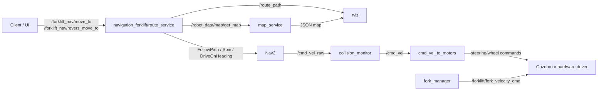

# ROS 2 Forklift Navigation Stack

Стенд на `ROS 2 Jazzy + Gazebo Sim + Nav2` для rear-steer погрузчика. Код разложен по пакетам по ответственности.

## Пакеты

- `forklift_demo` - demo/sim launch, URDF, meshes, Gazebo world/models, `ros_gz_bridge` config.
- `navigation_forklift` - маршрутизация, Nav2 execution, `route_service`, Nav2/SLAM configs.
- `cmd_vel_to_motors` - кинематика: перевод `/cmd_vel` в steering/wheel команды.
- `fork_manager` - управление вилами и конфиг slider-паблишера.
- `map_service` - JSON-карта и сервис `/robot_data/map/get_map`.
- `collision_monitor` - конфиг `nav2_collision_monitor` и scan sector filters.
- `rviz` - RViz layout и debug/visualization helper-ноды.
- `forklift_interfaces` - общие srv интерфейсы, сейчас `StringWithJson.srv`.
- `palette_picking` - пустой резерв под picking logic.
- `cmd_vel_arcestrator` - пустой резерв под оркестрацию velocity-команд.
- `vda5050_3_driver` - пустой резерв под VDA5050 v3 integration.

В каждом пакете есть свой `README.md` с ответственностью, составом и связями.

## Текущий runtime flow



## Быстрый запуск

```bash
colcon build --symlink-install --packages-up-to forklift_demo
source install/setup.bash
ros2 launch forklift_demo sim_followpath.launch.py launch_rviz:=false launch_gz_gui:=true
```

Docker:

```bash
docker compose up --build sim
```

## Полезные сервисы

- JSON карта: `/robot_data/map/get_map`
- Маршрут: `/forklift_nav/move_to`
- Маршрут с последним ребром задом: `/forklift_nav/revers_move_to`
- Совместимый вход: `/robot_data/route/go_to_point`
- Refresh визуализации карты: `/robot_data/map/visualize`

## Steering gate

В `cmd_vel_to_motors/config/cmd_vel_to_motors.yaml` сейчас отключено ожидание выравнивания рулевого перед стартом колеса:

```yaml
require_steering_alignment: false
```

Включить обратно можно через YAML или параметр:

```bash
ros2 run cmd_vel_to_motors cmd_vel_to_motors --ros-args -p require_steering_alignment:=true
```
