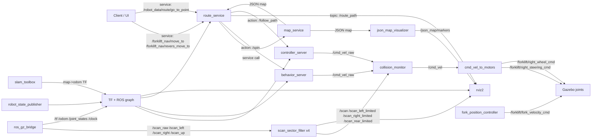

# ROS 2 Forklift Navigation Stack

Стенд на `ROS 2 Jazzy + Gazebo Sim + Nav2` для rear-steer погрузчика.

## Что используется сейчас

### Самописные пакеты

- `forklift_demo_control` (Python-ноды управления и сервисы):
  - `route_service` (JSON-маршрутизация + вызовы `FollowPath`/`Spin`)
  - `map_service` (отдает JSON-карту)
  - `json_map_visualizer` (рисует точки/ребра/yaw-маркеры)
  - `cmd_vel_to_motors` (перевод `cmd_vel` в steering/wheel команды)
  - `fork_position_controller`
  - `scan_sector_filter`
  - `up_lidar_marker_service`
  - `cmd_vel_activity_service`
- `forklift_demo_description`:
  - launch, URDF, world, RViz-конфиг, параметры Nav2/SLAM/bridge

### Готовые (внешние) пакеты

- Gazebo/bridge:
  - `ros_gz_sim`
  - `ros_gz_bridge`
- Навигация/локомоция:
  - `nav2_controller` (`RegulatedPurePursuit`)
  - `nav2_behaviors` (`behavior_server`, `Spin`)
  - `nav2_collision_monitor`
  - `nav2_lifecycle_manager`
  - `nav2_msgs`
- Локализация/карта:
  - `slam_toolbox`
- Системные:
  - `robot_state_publisher`
  - `tf2_ros`
  - `rviz2`
  - `xacro`

## Текущая архитектура



## Что запускается в `sim_followpath.launch.py`

- Gazebo Sim (GUI/headless)
- `robot_state_publisher`
- `ros_gz_bridge`
- `slam_toolbox`
- `controller_server`
- `behavior_server` (только `Spin`)
- `collision_monitor`
- `lifecycle_manager_navigation`
- все ноды `forklift_demo_control` из списка выше
- опционально встроенный RViz (`launch_rviz:=true`)

## Nav flow (коротко)

1. Клиент вызывает `move_to` или `revers_move_to`.
2. `route_service` берет JSON-карту из `map_service`, строит путь по графу.
3. Перед каждым `FollowPath` проверяет ориентацию робота и при необходимости вызывает `Spin`.
4. Публикует `Path` в `/route_path` и отправляет action `FollowPath`.
5. Скорость идет через цепочку:
   `controller/behavior -> /cmd_vel_raw -> collision_monitor -> /cmd_vel -> cmd_vel_to_motors -> Gazebo joints`.

## Launch-аргументы

- `launch_gz_gui` (default: `true`)
- `launch_rviz` (default: `false`)
- `enable_cmd_vel_to_motors` (default: `true`)
- `use_sim_time` (default: `true`)
- `world`, `x`, `y`, `yaw`

## Статус steering-gate в `cmd_vel_to_motors`

Сейчас механизм "не крутить колесо, пока рулевое не выровнено" отключен параметром:

- `require_steering_alignment: false`

Где это выставлено:

- `src/forklift_demo_description/launch/sim_followpath.launch.py`

Как включить обратно:

1. В launch вернуть `require_steering_alignment: true`.
2. Либо переопределить параметр при запуске ноды:

```bash
ros2 run forklift_demo_control cmd_vel_to_motors --ros-args -p require_steering_alignment:=true
```

## Полезные сервисы

- JSON карта:
  - `/robot_data/map/get_map`
- Запуск маршрута:
  - `/forklift_nav/move_to`
  - `/forklift_nav/revers_move_to`
  - `/robot_data/route/go_to_point` (compat)
- Ручной refresh визуализации карты:
  - `/robot_data/map/visualize`

## Мои сервисы и связь с Nav2

### `/forklift_nav/move_to` (`route_service`)

- Вход: `ros2_templates/srv/StringWithJson` (ожидается id/alias целевой точки).
- Что делает:
  1. Запрашивает граф карты через `/robot_data/map/get_map`.
  2. Строит путь по JSON-графу.
  3. Для короткого пути (`< short_route_threshold_m`) делает:
     - `Spin` (`/spin`, action `nav2_msgs/action/Spin`) в направление движения,
     - `DriveOnHeading` (`/drive_on_heading`, action `nav2_msgs/action/DriveOnHeading`) на длину сегмента.
  4. Для обычного пути:
     - при необходимости делает `Spin`,
     - отправляет `FollowPath` (`/follow_path`, action `nav2_msgs/action/FollowPath`).
- Нав2-интеграция:
  - `behavior_server`: `/spin`, `/drive_on_heading`
  - `controller_server`: `/follow_path`
  - публикует диагностический путь в `/route_path` (RViz).

### `/forklift_nav/revers_move_to` (`route_service`)

- Вход: `ros2_templates/srv/StringWithJson` (id/alias точки).
- Что делает:
  1. Строит маршрут по JSON-графу.
  2. Делит на два этапа:
     - prefix (передом),
     - последний edge (задом).
  3. На каждом этапе применяет ту же логику:
     - коротко: `Spin + DriveOnHeading`,
     - длинно: `Spin + FollowPath`.
- Режим учитывается явно:
  - `forward` для prefix,
  - `reverse` для последнего edge (угол выравнивания и знак скорости инвертируются).

### `/robot_data/route/go_to_point` (compat)

- Это совместимый вход в тот же `route_service`.
- Дальше используется тот же pipeline Nav2, что и для `move_to`.

### `/robot_data/map/get_map` (`map_service`)

- Отдает JSON-граф (`point`/`path`), который использует `route_service`.
- С Nav2 напрямую не взаимодействует, но определяет геометрию маршрутов, которые потом уходят в `Spin/DriveOnHeading/FollowPath`.

## Быстрый запуск (Docker)

```bash
docker compose up --build
```

Отдельно:

```bash
docker compose up sim
docker compose up rviz
docker compose up rqt
```

## Основные файлы

- `src/forklift_demo_description/launch/sim_followpath.launch.py`
- `src/forklift_demo_description/config/nav2_params.yaml`
- `src/forklift_demo_description/config/collision_monitor_params.yaml`
- `src/forklift_demo_description/config/slam_toolbox.yaml`
- `src/forklift_demo_description/config/bridge_config.yaml`
- `src/forklift_demo_description/urdf/forklift_demo.urdf.xacro`
- `src/forklift_demo_description/worlds/square_room.sdf`
- `src/forklift_demo_description/rviz/demo.rviz`
- `src/forklift_demo_control/forklift_demo_control/route_service.py`
- `src/forklift_demo_control/forklift_demo_control/map_service.py`
- `src/forklift_demo_control/forklift_demo_control/map_data.py`
- `src/forklift_demo_control/forklift_demo_control/json_map_visualizer.py`
- `src/forklift_demo_control/forklift_demo_control/cmd_vel_to_motors.py`
- `src/forklift_demo_control/forklift_demo_control/scan_sector_filter.py`
