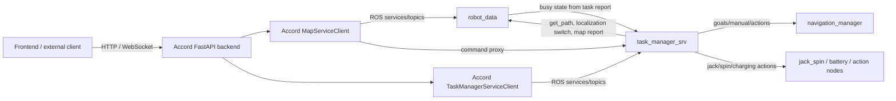
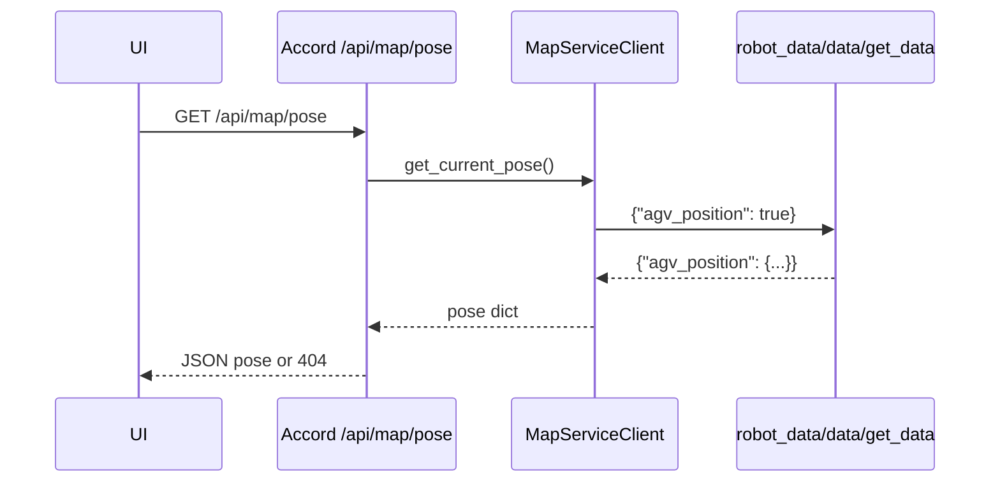
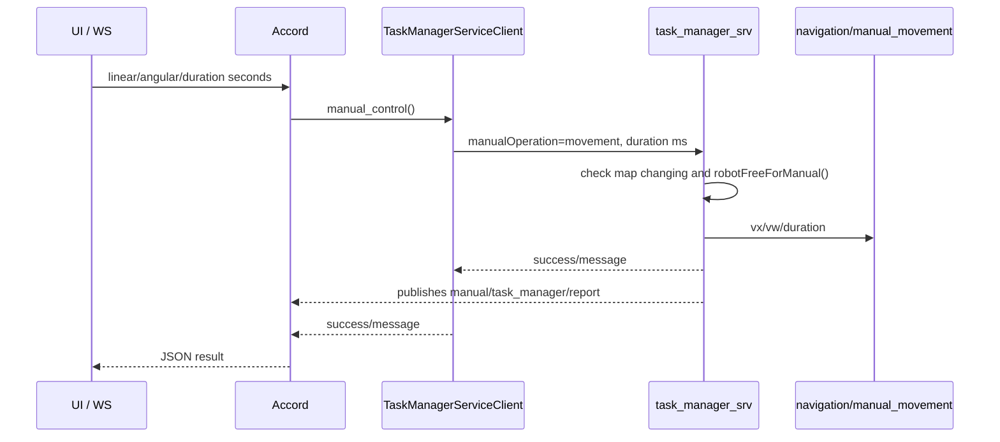
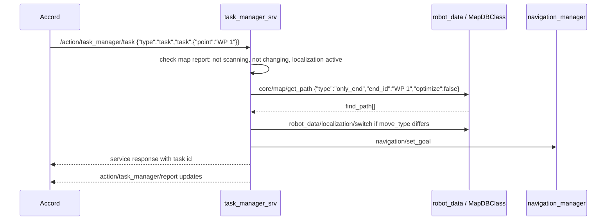
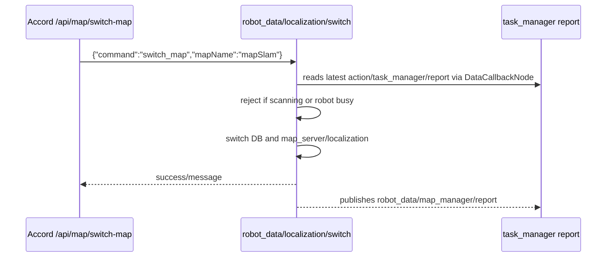

# Интерфейс взаимодействия Accord с модулями робота

Документ описывает текущий контракт между backend `accord` и ROS2-модулями робота по исходникам workspace. Основной фокус: `robot_data` и `task_manager_srv`.

## 1. Общая схема

`accord` работает как HTTP/WebSocket-шлюз поверх ROS2:



При старте `accord` вызывает `rclpy.init()`, создает ROS-клиенты в `init_ros_clients()` и добавляет их в `MultiThreadedExecutor`. Для интерфейсов из этого документа важны два клиента:

- `MapServiceClient`: доступ к `robot_data`, карте, позе, лидарам, скорости.
- `TaskManagerServiceClient`: доступ к `task_manager_srv`, задачам, ручному управлению и отчету задач.

Большинство сервисов используют `ros2_templates/srv/StringWithJson`:

```text
request:
  string message
response:
  bool success
  string message
```

То есть тип ROS-сервиса почти всегда одинаковый, а фактический контракт задается JSON-строкой в поле `message`.

## 2. HTTP API Accord

Основные FastAPI-prefixes:

| HTTP prefix | Назначение | ROS-клиент |
|---|---|---|
| `/api/robot` | информация о роботе | `MapServiceClient` -> `robot_data/data/get_data` |
| `/api/map` | поза, карты, локализация, лидары | `MapServiceClient` -> `robot_data` |
| `/api/task` | низкоуровневый прокси в Task Manager | `TaskManagerServiceClient` |
| `/api/move` | команды движения и ручного управления | `TaskManagerServiceClient` |
| `/api/task-caller` | удобные готовые вызовы задач | `TaskManagerServiceClient`, иногда `MapServiceClient` |
| `/api/telemetry` | скорость робота | `MapServiceClient` |
| `/api/ws` | телеметрия и ручное движение по WebSocket | `MapServiceClient`, `TaskManagerServiceClient` |

## 3. Accord -> robot_data

### 3.1 Сервисы robot_data, используемые Accord

| ROS service/topic | Тип | Кто вызывает | Назначение |
|---|---|---|---|
| `robot_data/data/get_data` | `StringWithJson` | `MapServiceClient` | агрегированное получение состояния робота |
| `robot_data/map/get_map` | `StringWithJson` | `MapServiceClient` | получение карты из файлов и БД |
| `robot_data/map/set_map` | `StringWithJson` | `MapServiceClient` | сохранение карты |
| `robot_data/map/change` | `StringWithJson` | `MapServiceClient` | удаление, переименование, сохранение scan-карты |
| `robot_data/map/update_pose` | `InitPosition` | `MapServiceClient` | установка начальной позы |
| `robot_data/localization/switch` | `StringWithJson` | `MapServiceClient`, `task_manager_srv` | смена локализации, карты, scan-режима |
| `robot_data/slam/get_scanned_map` | `StringWithJson` | `MapServiceClient` | получение карты, построенной во время scan |
| `core/map/get_marker_group` | `GetMarkerGroup` | `MapServiceClient` | получение marker groups из БД карты |
| `core/map/get_path` | `StringWithJson` | `MapServiceClient`, `task_manager_srv` | построение пути до точки |
| `robot_data/map_manager/report` | `std_msgs/String` JSON | публикует `robot_data`; читает `task_manager_srv` | статус карты, локализации и scan/change |

### 3.2 `robot_data/data/get_data`

Запрос: JSON с bool-флагами нужных полей.

```json
{
  "agv_position": true,
  "maps": true,
  "version": true,
  "manufacturer": true,
  "serial_number": true,
  "velocity": true,
  "laser_scan": true,
  "laser_scan_global": true,
  "battery_state": true
}
```

Флаги независимые: можно запросить одно поле или несколько. Если ни один известный флаг не передан, сервис вернет `success=false` и сообщение `Нет совпадений в запросе`.

Поля ответа:

| Поле | Содержимое |
|---|---|
| `agv_position` | `x`, `y`, `theta`, `map_name`, `position_initialized`, `localization_score` |
| `maps` | массив `map_name`, `map_timestamp`, `map_version`, `map_status` |
| `version` | строка версии из `DataCallbackNode` |
| `manufacturer` | производитель |
| `serial_number` | серийный номер, сгенерированный из CPU id |
| `velocity` | `vx`, `vy`, `omega` из `/odometry/filtered` |
| `laser_scan` | массив лидаров с pose и полярными точками |
| `laser_scan_global` | плоский массив точек `x`, `y`, `intensity` в карте |
| `battery_state` | `battery_charge`, `battery_voltage`, `charging` |

Пример запроса позы:

```bash
ros2 service call /robot_data/data/get_data ros2_templates/srv/StringWithJson \
  "{message: '{\"agv_position\": true}'}"
```

`Accord` использует это для:

- `/api/map/pose`
- `/api/robot/info`
- `/api/map/laser-scan`
- `/api/map/laser-scan-global`
- списка карт через `MapServiceClient.get_maps_list()`

### 3.3 Карта

Получение карты:

```json
{
  "mapName": "mapSlam"
}
```

Если `mapName` не указан, `robot_data/map/get_map` возвращает текущую карту. Успешный `response.message` содержит JSON:

```json
{
  "header": {
    "name": "mapSlam",
    "version": "1.0.0",
    "timestamp": 1710000000000,
    "min_x": 0.0,
    "min_y": 0.0,
    "max_x": 10.0,
    "max_y": 10.0
  },
  "costmap": [{"x": 1.0, "y": 2.0}],
  "map": {
    "point": [],
    "path": [],
    "area": []
  },
  "map_rules": {}
}
```

Сохранение карты через `robot_data/map/set_map` ожидает объект с:

```json
{
  "header": {
    "name": "new_map",
    "version": "1.0.0",
    "timestamp": 1710000000000,
    "min_x": 0.0,
    "min_y": 0.0,
    "max_x": 10.0,
    "max_y": 10.0
  },
  "map": {
    "point": [],
    "path": []
  },
  "costmap": [],
  "auto_switch": true
}
```

Ограничения сохранения:

- `header.name` не может быть `empty`.
- `header.version` должна быть валидной версией.
- `header.timestamp` проверяется.
- `header.max_x/max_y` должны быть больше `min_x/min_y`.
- `auto_switch` опционален, по умолчанию `true`.

Изменение карты через `robot_data/map/change`:

```json
{"command": "delete", "mapName": "old_map"}
{"command": "rename", "oldName": "old_map", "newName": "new_map"}
{"command": "save_scan"}
```

Важные ограничения:

- нельзя удалить активную карту;
- нельзя удалить или перезаписать системную карту `empty`;
- переименование активной карты временно переключает `map_server` и БД на `empty`, затем откатывает или возвращает активную карту.

### 3.4 Поза и локализация

`robot_data/map/update_pose` использует `ros2_templates/srv/InitPosition`:

```text
float64 x
float64 y
float64 theta
---
bool success
string message
```

Ограничения:

- нельзя обновлять позу, если робот занят задачей;
- нельзя обновлять позу во время scan;
- `theta` должен быть в диапазоне `[-pi, pi]`.

В зависимости от текущей локализации `robot_data` публикует:

- `/initialpose` для `amcl`;
- `/markers_pose` для `markers`.

`robot_data/localization/switch` принимает команды:

```json
{"command": "amcl"}
{"command": "markers"}
{"command": "scan"}
{"command": "stop_scan"}
{"command": "switch_map", "mapName": "mapSlam"}
```

Для `switch_map` `robot_data` проверяет, что робот не сканирует и не выполняет задачу. Занятость берется из подписки на `action/task_manager/report`.

### 3.5 Репорт map manager

`robot_data` публикует `robot_data/map_manager/report`:

```json
{
  "scanning": false,
  "changing": false,
  "current_localization": "amcl",
  "current_map_name": "mapSlam",
  "current_map_db_name": "mapSlam"
}
```

Этот репорт читает `task_manager_srv`. Перед запуском задач Task Manager запрещает старт, если:

- `scanning=true`;
- `changing=true`;
- `current_localization` не `amcl` и не `markers`.

## 4. Accord -> task_manager_srv

### 4.1 Сервисы Task Manager, используемые Accord

| ROS service/topic | Тип | Кто вызывает | Статус реализации |
|---|---|---|---|
| `action/task_manager/manual_control` | `StringWithJson` | `TaskManagerServiceClient` | реализовано |
| `action/task_manager/command` | `StringWithJson` | `TaskManagerServiceClient` | реализовано для активной задачи |
| `action/task_manager/task` | `StringWithJson` | `TaskManagerServiceClient` | реализовано |
| `action/task_manager/task_chain` | `StringWithJson` | `TaskManagerServiceClient` | заглушка, возвращает `Пока не доступно` |
| `action/task_manager/order` | `StringWithJson` | `TaskManagerServiceClient` | заглушка, возвращает `Пока не доступно` |
| `action/task_manager/report` | `std_msgs/String` JSON | публикует `task_manager_srv`; читает `accord` и `robot_data` | реализовано |
| `manual/task_manager/report` | `std_msgs/String` JSON | публикует `task_manager_srv` | реализовано, `Accord` напрямую не подписан |
| `/tasks` | `rcl_interfaces/msg/Log` | публикует `task_manager_srv` | лог задач |

### 4.2 Ручное управление

`Accord` HTTP принимает секунды:

```json
{
  "linear_speed": 0.5,
  "angular_speed": 0.0,
  "duration": 1.0
}
```

`TaskManagerServiceClient.manual_control()` конвертирует `duration` в миллисекунды и отправляет в ROS:

```json
{
  "manualOperation": "movement",
  "manualParam": {
    "linear_speed": 0.5,
    "angular_speed": 0.0,
    "duration": 1000
  }
}
```

Task Manager проверяет:

- `manualOperation` должен быть строкой `movement`;
- `manualParam` должен быть объектом;
- `linear_speed`, `angular_speed`, `duration` должны быть числами;
- `duration >= 0`;
- ручное движение запрещено, если карта сейчас меняется;
- ручное движение запрещено, если активна задача, цепочка или order.

Дальше Task Manager вызывает `navigation/manual_movement` (`ManualMovement.srv`):

```text
float64 vx
float64 vw
float64 duration
---
bool success
string error_msg
```

### 4.3 Команды активной задачи

Формат для `action/task_manager/command` при активном `task_timer`:

```json
{
  "type": "command",
  "command": "pause"
}
```

Допустимые команды:

- `pause`
- `resume`
- `cancel`

Если активной задачи нет, сервис возвращает `success=true`, `message="Робот свободен от задач"` без разбора JSON.

Для driving-команды Task Manager вызывает `navigation/control`. Для action-команды вызывает control-сервис соответствующего конечного action-узла.

### 4.4 Задача

Формат для `action/task_manager/task`:

```json
{
  "type": "task",
  "task": {
    "point": "WP 1",
    "action": "rotation_deg",
    "action_args": {
      "angle": 90
    }
  }
}
```

`task.point` и `task.action` могут использоваться отдельно или вместе:

- если есть `point`, Task Manager запрашивает путь через `core/map/get_path`;
- если есть `action`, Task Manager валидирует действие через `ActionFactory`;
- если есть оба поля, сначала выполняется driving, затем action.

Запрос пути для точки:

```json
{
  "type": "only_end",
  "end_id": "WP 1",
  "optimize": false
}
```

Ответ `core/map/get_path` должен содержать `find_path`, где Task Manager ожидает поля:

```json
{
  "find_path": [
    {
      "name": "WP 1",
      "position_x": 1.0,
      "position_y": 2.0,
      "position_theta": 0.0,
      "use_down_marker": false,
      "direction": "forward",
      "move_type": "amcl",
      "is_through": false,
      "is_last": true
    }
  ]
}
```

Перед каждой driving-точкой Task Manager сравнивает `move_type` с `current_localization` из `robot_data/map_manager/report`. Если нужно, вызывает `robot_data/localization/switch` с `{"command": "amcl"}` или `{"command": "markers"}`.

Driving-goal в `navigation/set_goal`:

```text
string loc_type
int8 direction
bool need_orientation
bool is_last
float64 x
float64 y
float64 yaw
---
bool success
string error_msg
```

### 4.5 Поддерживаемые action-типы

| `action` | Минимальные `action_args` | Конечный сервис |
|---|---|---|
| `moving` | `{"distance": number}` | `navigation/translation` |
| `translation` | `{"distance": positive, "vx": nonzero}` | `navigation/translation` |
| `rotation_deg` | `{"angle": number}` | `navigation/rotation` |
| `rotation_rad` | `{"angle": number}` | `navigation/rotation` |
| `rotation` | `{"angle": positive, "vw": nonzero}` | `navigation/rotation` |
| `free_path` | `{"x": number, "y": number, "theta": number, "need_orientation": bool?}` | `navigation/set_goal` |
| `start_charging` | `{}` | `battery/charging` |
| `stop_charging` | `{}` | `battery/charging` |
| `jack_height` | `{"end_height": number, "v": number?}` | `jack_spin/jack` |
| `jack_load` | optional `start_height`, `end_height`, `v`, `recognize`, `rec_file` | `jack_spin/jack` |
| `jack_unload` | optional `start_height`, `end_height`, `v`, `recognize`, `rec_file` | `jack_spin/jack` |
| `spin_rotation` | `{"angle": number, "wv": number?}` | `jack_spin/spin` |

Пример ROS-вызова задачи:

```bash
ros2 service call /action/task_manager/task ros2_templates/srv/StringWithJson \
  "{message: '{\"type\":\"task\",\"task\":{\"action\":\"rotation_deg\",\"action_args\":{\"angle\":90}}}'}"
```

Пример задачи движения к точке:

```bash
ros2 service call /action/task_manager/task ros2_templates/srv/StringWithJson \
  "{message: '{\"type\":\"task\",\"task\":{\"point\":\"WP 1\"}}'}"
```

### 4.6 Репорт задачи

`task_manager_srv` публикует `action/task_manager/report`:

```json
{
  "type": "task",
  "id": "generated-task-id",
  "status": "RUNNING",
  "safety_status": "OK",
  "error_message": "",
  "task": {
    "driving_exist": true,
    "driving_info": {
      "path": ["WP 1"],
      "status": "RUNNING",
      "safety_status": "OK",
      "details": {}
    },
    "action_exist": false,
    "action_info": {}
  }
}
```

Статусы, которые обрабатываются в коде:

- `WAITING`
- `INITIALIZING`
- `RUNNING`
- `PAUSED`
- `BLOCKED`
- `FINISHED`
- `FAILED`
- `CANCELED`

`Accord` хранит последний отчет в памяти и отдает его через:

- `/api/task/manager/report`
- `/api/move/report`
- WebSocket telemetry field `task`

`robot_data` тоже читает этот топик и считает робота занятым при `type="task"` и статусе `RUNNING`, `PAUSED` или `BLOCKED`.

## 5. Главные сценарии взаимодействия

### 5.1 Получение позы



### 5.2 Ручное движение



### 5.3 Движение к точке



### 5.4 Смена карты



## 6. Взаимные блокировки и зависимости состояния

| Кто блокирует | На основании чего | Что блокируется |
|---|---|---|
| `robot_data` | `action/task_manager/report` со статусом `RUNNING`, `PAUSED`, `BLOCKED` | `update_pose`, `switch_map`, scan/start-stop операции |
| `task_manager_srv` | `robot_data/map_manager/report.scanning` | запуск задач |
| `task_manager_srv` | `robot_data/map_manager/report.changing` | запуск задач и ручное движение |
| `task_manager_srv` | активные timers task/manual/order | новый task/manual/order |
| `task_manager_srv` | `current_localization` не `amcl`/`markers` | запуск задач |

## 7. Обнаруженные расхождения в текущем коде

Эти пункты важны для интеграции, потому что они меняют фактическую работоспособность API:

1. `/api/task/manager/task` и `/api/task-caller/*` используют правильную схему Task Manager: `{"type":"task","task":{...}}`.
2. Часть endpoints в `/api/move` формирует `{"type":"action","action_type":...,"action_parameters":...}`. Текущий `TaskManager::process_request()` принимает только `type="task"` или `type="command"`, поэтому такие запросы будут отклонены как `Неизвестный тип в 'type'`.
3. `action/task_manager/task_chain` и `action/task_manager/order` есть в `Accord` и в `task_manager_srv`, но на стороне `task_manager_srv` это заглушки.
4. `TaskManagerServiceClient` в `Accord` создает publisher `/action/task_manager/manual_control`, но фактический интерфейс Task Manager на этом имени - сервис `StringWithJson`; publisher в текущем клиенте не используется.
5. `hold_spin` есть в `TaskManagerClient::actionEndNode()`, но `ActionFactory` не создает валидатор для `hold_spin`, поэтому как обычная `task.action` команда он не пройдет `checkAction()`.
6. `spin_rotation` валидирует аргумент `wv`, но отправка в `TaskManagerClient::actionEndNode()` ищет `vw`; если передать только `wv`, скорость будет взята из дефолта.

## 8. Источники в коде

Ключевые файлы:

- `src/accord/accord/accord.py` - регистрация FastAPI routers и lifecycle.
- `src/accord/accord/utils.py` - создание ROS-клиентов Accord.
- `src/accord/accord/srv/clients/map_client.py` - ROS-интерфейс Accord к `robot_data`.
- `src/accord/accord/srv/clients/task_manager_client.py` - ROS-интерфейс Accord к `task_manager_srv`.
- `src/accord/accord/routers/robot.py`, `map.py`, `task.py`, `move.py`, `task_caller.py`, `telemetry.py`, `websocket.py` - HTTP/WebSocket слой.
- `src/dikom-robotics/robot_data/src/robot_data/robot_data_service.cpp` - `robot_data/data/get_data`.
- `src/dikom-robotics/robot_data/src/map_manager/map_manager_service.cpp` - карта, локализация, scan, map report.
- `src/dikom-robotics/robot_data/src/map_manager/map_db_class.cpp` - `core/map/get_path`, `core/map/get_marker_group`.
- `src/dikom-robotics/robot_data/src/robot_data/data_callback_node.cpp` - входные топики и состояние robot_data.
- `src/dikom-robotics/task_manager_srv/src/task_manager_service.cpp` - сервисы Task Manager и блокировки.
- `src/dikom-robotics/task_manager_srv/src/task_manager/task_manager.cpp` - разбор task/command, отчеты и исполнение.
- `src/dikom-robotics/task_manager_srv/src/manual_control/manual_control.cpp` - JSON ручного управления.
- `src/dikom-robotics/task_manager_srv/src/task_manager_client.cpp` - downstream-вызовы navigation, robot_data, jack_spin, charging.
- `src/dikom-robotics/ros2_templates/srv/StringWithJson.srv` - общий транспорт JSON.

## 9. Оценка интеграции связи с Accord в текущий проект

В текущем workspace прямой интеграции с `Accord` пока нет: отсутствует сам пакет
`accord`, а также исходные backend-зависимости, под которые он написан:
`robot_data`, `task_manager_srv` и `ros2_templates`. Текущий проект уже имеет
другую архитектурную границу: `robot_control_core` является владельцем миссии,
а `map_service`, `navigation_forklift`, `cmd_vel_arcestrator`,
`palette_docking` и `fork_manager` закрывают отдельные возможности погрузчика.

Оценка сложности:

| Вариант | Сложность | Почему |
|---|---|---|
| Адаптировать `Accord` под текущий `robot_control_core` | средняя | нужно переписать ROS-клиенты Accord на текущие сервисы и статус, но не нужно восстанавливать старый `task_manager_srv` |
| Поднять `Accord` без изменений и добавить совместимые ROS-сервисы | высокая | придется реализовать совместимость с большим контрактом `robot_data`/`task_manager_srv`, включая карты, локализацию, task report, manual report и старые action-типы |
| Перенести текущий проект на старую связку `robot_data` + `task_manager_srv` | высокая и архитектурно нежелательная | это дублирует ответственность `robot_control_core` как единственного владельца миссии |

Наиболее практичный путь - добавлять не старый `task_manager_srv`, а тонкий
адаптационный слой между HTTP/WebSocket API Accord и текущими ROS-интерфейсами.
Тогда `Accord` остается внешним API/UI-шлюзом, а `robot_control_core` продолжает
быть единственным владельцем миссии, pause/resume/cancel, `actionStates`,
`loads` и ошибок.

Минимально нужны следующие новые или доработанные модули:

| Модуль | Назначение | Статус относительно текущего workspace |
|---|---|---|
| `accord` или `accord_gateway` | FastAPI/WebSocket backend, HTTP endpoints, lifecycle ROS-клиентов | отсутствует |
| `accord_robot_control_adapter` | перевод `/api/task`, `/api/move`, `/api/task-caller` в `/robot_control_core/control` | отсутствует |
| `accord_status_adapter` | подписка на `/robot_control_core/status` и преобразование в формат, ожидаемый Accord UI/API | отсутствует |
| `accord_map_adapter` | совместимость `/api/map/*` с текущим `map_service` и `navigation_forklift`; получение карты, списка точек, маршрута и текущей позы | отсутствует частично, есть только низкоуровневый `map_service` |
| `robot_data_compat` | совместимые сервисы `robot_data/data/get_data`, `robot_data/map/get_map`, `core/map/get_path`, если Accord оставлять почти без изменений | отсутствует |
| `manual_control_adapter` | безопасное ручное движение через `cmd_vel_arcestrator`, а не прямой `cmd_vel` | отсутствует как Accord-совместимый API; низкоуровневый `cmd_vel_arcestrator` есть |
| `telemetry_adapter` | сбор позы, скорости, battery/fork/load/task state для `/api/telemetry` и WebSocket | отсутствует |
| `battery_state_provider` | источник заряда, напряжения и charging state | отсутствует, если нужен полный `/api/robot/info` как в Accord |
| `localization_map_manager` | переключение карты/локализации, scan mode, начальная поза | в текущем проекте не реализован в объеме `robot_data` |
| launch/config для связки Accord | запуск FastAPI, ROS executor, remap сервисов, параметры URL/портов | отсутствует |

Что можно переиспользовать без дублирования:

- `robot_control_core` - целевой backend для mission/order actions, pause,
  resume, cancel, operating mode и status.
- `map_service` - источник JSON-карты, но его контракт уже проще, чем
  `robot_data/map/get_map`.
- `navigation_forklift` - исполнение маршрутов и статус навигации.
- `cmd_vel_arcestrator` - безопасная точка выбора источника движения.
- `palette_docking` - `finePositioning`/docking для паллет.
- `fork_manager` - фактическое управление вилами.
- `vda5050_3_driver` - будущий протокольный адаптер для MQTT/VDA; его не стоит
  смешивать с Accord HTTP API.

Критичные разрывы, которые надо закрыть перед рабочей интеграцией:

1. `Accord` ожидает `ros2_templates/srv/StringWithJson`, а текущий проект
   использует `forklift_interfaces/srv/StringWithJson`. Формат похожий, но
   зависимости и имена типов разные.
2. `Accord` говорит с `action/task_manager/*`, тогда как текущая точка
   управления миссией - `/robot_control_core/control`.
3. `Accord` ожидает `action/task_manager/report`, а текущий статус публикуется в
   `/robot_control_core/status`.
4. `Accord` ожидает богатый `robot_data/data/get_data`: pose, maps, velocity,
   laser scan, battery. В текущем workspace эти данные распределены по разным
   узлам или отсутствуют.
5. Управление картой и локализацией в стиле `robot_data/localization/switch`
   сейчас не закрыто отдельным полноценным модулем.

Итоговая оценка: интеграция связи с Accord выполнима, но это не
`plug-and-play`. Для демо/UI с базовыми командами, статусом, картой и ручным
движением это задача средней сложности: достаточно `accord_gateway` и набора
адаптеров к текущим сервисам. Для полной совместимости с исходным Accord API,
включая старые `robot_data`/`task_manager_srv` контракты, сложность высокая,
потому что придется либо восстанавливать отсутствующие пакеты, либо тщательно
эмулировать их ROS-интерфейсы поверх текущей архитектуры.
