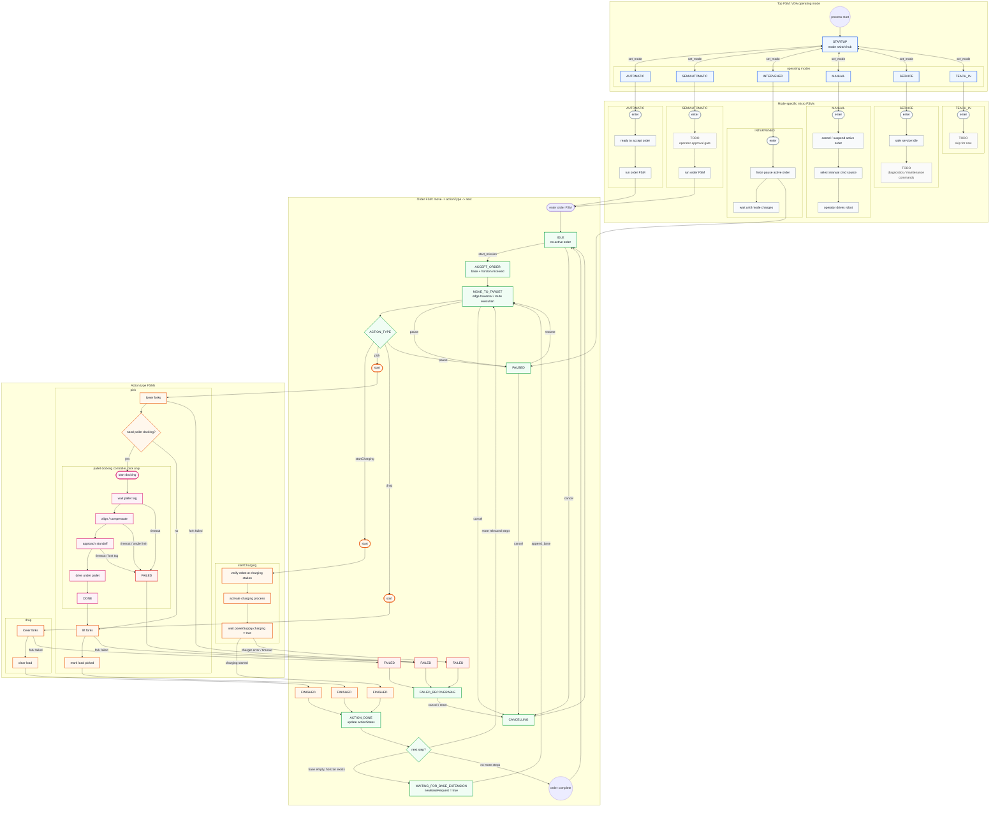

# robot_control_core

`robot_control_core` - центральный владелец миссии погрузчика. Он не работает с
MQTT и не парсит VDA 5050 напрямую; этим должен заниматься адаптер
`vda5050_3_driver`. Ядро принимает JSON через ROS-сервис, выполняет разрешенные
VDA-действия заказа через локальные ROS-возможности и публикует
нормализованное состояние для VDA-адаптера, UI или тестов.

Нода должна быть единственным владельцем активной миссии. Внешним компонентам не
нужно напрямую дергать вилы, docking или `cmd_vel_arcestrator`, если операция
является частью выполнения заказа.

## Запуск и интерфейсы

- Нода: `robot_control_core`
- Сервис управления: `/robot_control_core/control`
- Тип сервиса: `forklift_interfaces/srv/StringWithJson`
- Топик статуса: `/robot_control_core/status`
- Тип статуса: `std_msgs/String`, внутри JSON
- FSM: YASMIN
- Web UI для FSM: YASMIN Viewer

Зависимости для запуска на хосте:

```bash
sudo apt install ros-$ROS_DISTRO-yasmin ros-$ROS_DISTRO-yasmin-viewer
```

В Docker эти пакеты ставятся из `Dockerfile`.

## Связи

```text
vda5050_3_driver / UI / tests
  -> /robot_control_core/control
robot_control_core
  -> ForkCapability    -> /forklift/fork_cmd + /joint_states
  -> DockingCapability -> /palette_docking/control
  -> MotionCapability  -> /cmd_vel_arcestrator/control
```

Навигация по ребрам VDA-заказа не является `actionType` в `robot_control_core`.
Перемещение по топологии заказа должно приходить из VDA-адаптера как состояние
узлов/ребер и отдельная логика маршрута, а не как action `navigate`.

## FSM

Миссия выполняется через YASMIN `StateMachine`. Сервисный слой ROS только меняет
данные миссии, ставит флаги паузы, отмены или расширения base и будит FSM.

Основные состояния:

```text
STARTUP -> IDLE -> ORDER_ACTIVE -> IDLE
                    |
                    +-> EXECUTING_BASE
                    +-> WAITING_FOR_BASE_EXTENSION
                    +-> PAUSED
                    +-> CANCELLING
                    +-> FAILED_RECOVERABLE
```

`MANUAL`, `SERVICE`, `TEACH_IN` и `STARTUP` блокируют старт миссии заказа.
`INTERVENED` ставит активную миссию на паузу.

Сейчас планировщик консервативный: одновременно выполняется только одно внешнее
VDA-действие. `blockingType` (`NONE`, `SINGLE`, `SOFT`, `HARD`) сохраняется в
состоянии, но параллельное выполнение `NONE`/`SOFT` пока не реализовано.

Если released base закончился, а `horizon_steps` еще есть, FSM переходит в
`WAITING_FOR_BASE_EXTENSION`, останавливает движение через `cmd_vel_arcestrator`
и публикует `newBaseRequest: true`.

### Большая Mermaid-схема FSM

Это архитектурный черновик, а не точное отражение текущего кода. Идея такая:
верхний FSM выбирает VDA operating mode, внутри каждого mode есть свой micro FSM,
а order-mode выполняет цикл `move -> actionType -> next`. Charging-действие
показано как VDA5050 v3.0 actionType `startCharging`.



## YASMIN Viewer

`robot_control_core` по умолчанию публикует активную FSM в `/fsm_viewer`.
Публикуются отдельные graph names:
`robot_control_core`, `automatic_mode`, `semiautomatic_mode`, `intervened_mode`.
В viewer можно выбрать как верхний автомат ноды, так и mode-specific FSM.

Запуск viewer отдельно:

```bash
ros2 run yasmin_viewer yasmin_viewer_node --ros-args -p host:=127.0.0.1 -p port:=5000
```

После этого открыть:

```text
http://127.0.0.1:5000/
```

Через demo launch:

```bash
ros2 launch forklift_demo sim_followpath.launch.py launch_yasmin_viewer:=true
```

Отключить публикацию FSM можно параметром:

```bash
ros2 run robot_control_core robot_control_core --ros-args -p enable_yasmin_viewer:=false
```

## Команды сервиса

Все команды отправляются в поле `message` как JSON-строка:

```bash
ros2 service call /robot_control_core/control forklift_interfaces/srv/StringWithJson 'message: >-
  {"command":"stateRequest"}'
```

Поддерживаемые команды:

- `stateRequest` - вернуть текущий статус.
- `start_mission` - старт новой миссии.
- `append_base` - добавить released base или выпустить часть horizon.
- `startPause` - поставить миссию на паузу.
- `stopPause` - снять миссию с паузы.
- `cancelOrder` - отменить активную миссию.
- `set_mode` - сменить режим работы.
- `reset` - сбросить активную миссию и локальные состояния.
- `clear_errors` - очистить список ошибок.

Алиасы, которые оставлены для внутренних тестов и старых клиентов:
`status`, `start`, `run_mission`, `extend_base`, `release_horizon`, `pause`,
`resume`, `release`, `cancel`, `mode`, `clear`.

## Примеры

Запрос статуса:

```bash
ros2 service call /robot_control_core/control forklift_interfaces/srv/StringWithJson 'message: >-
  {"command":"stateRequest"}'
```

Миссия `pick -> drop` без экранирования кавычек:

```bash
ros2 service call /robot_control_core/control forklift_interfaces/srv/StringWithJson 'message: |-
  {"command":"start_mission","mission_id":"demo_pick_drop","steps":[
    {"actionType":"pick","actionId":"pick_1","blockingType":"HARD","actionParameters":[{"key":"loadId","value":"L1"}]},
    {"actionType":"drop","actionId":"drop_1","blockingType":"HARD","actionParameters":[{"key":"loadId","value":"L1"}]}
  ]}'
```

Миссия с `finePositioning` перед `pick`:

```bash
ros2 service call /robot_control_core/control forklift_interfaces/srv/StringWithJson 'message: |-
  {"command":"start_mission","mission_id":"demo_pick_with_dock","steps":[
    {"actionType":"finePositioning","actionId":"fp_1","blockingType":"HARD","actionParameters":[{"key":"stationName","value":"pallet_b_south_08_tag"}]},
    {"actionType":"pick","actionId":"pick_1","blockingType":"HARD","actionParameters":[{"key":"stationName","value":"pallet_b_south_08_tag"},{"key":"loadId","value":"L1"}]}
  ]}'
```

Pause/resume/cancel:

```bash
ros2 service call /robot_control_core/control forklift_interfaces/srv/StringWithJson 'message: >-
  {"command":"startPause"}'

ros2 service call /robot_control_core/control forklift_interfaces/srv/StringWithJson 'message: >-
  {"command":"stopPause"}'

ros2 service call /robot_control_core/control forklift_interfaces/srv/StringWithJson 'message: >-
  {"command":"cancelOrder"}'
```

Выпустить два действия из horizon в base:

```bash
ros2 service call /robot_control_core/control forklift_interfaces/srv/StringWithJson 'message: >-
  {"command":"append_base","release_horizon_count":2}'
```

Сменить operating mode:

```bash
ros2 service call /robot_control_core/control forklift_interfaces/srv/StringWithJson 'message: >-
  {"command":"set_mode","mode":"AUTOMATIC"}'
```

## Формат миссии

`start_mission` принимает:

- `mission_id` - внутренний идентификатор миссии.
- `order_id`, `order_update_id` - VDA-идентификаторы, пробрасываются в
  статус.
- `steps` - released base actions.
- `base_steps` - алиас для `steps`.
- `horizon_steps` - запланированные, но еще не released actions.
- `nodeStates`, `edgeStates` - VDA-массивы состояния, пробрасываются в
  status.

Каждый step должен иметь:

- `actionType` - один из поддерживаемых VDA action types.
- `actionId` - идентификатор действия; если не задан, ядро сгенерирует ID.
- `blockingType` - `NONE`, `SINGLE`, `SOFT` или `HARD`; по умолчанию `HARD`.
- `actionParameters` - массив объектов `{ "key": "...", "value": ... }`.

Параметры также можно передавать верхнеуровневыми полями step. Они будут
собраны в общий словарь параметров действия, кроме служебных полей вроде
`actionType`, `actionId`, `blockingType`.

## Поддерживаемые VDA-действия заказа

Внешне доступны только:

```json
{"actionType":"finePositioning","actionParameters":[{"key":"stationName","value":"pallet_b_south_08_tag"}]}
{"actionType":"pick","actionParameters":[{"key":"stationName","value":"pallet_b_south_08_tag"},{"key":"loadId","value":"L1"}]}
{"actionType":"drop","actionParameters":[{"key":"loadId","value":"L1"}]}
```

`finePositioning` вызывает `/palette_docking/control` и переключает
`cmd_vel_arcestrator` на источник `pallet_docking`.

`pick` внутри выполняет:

```text
опустить грузозахват -> optional finePositioning -> поднять грузозахват -> обновить loads
```

По умолчанию `pick` делает `finePositioning`. Отключить можно параметром
`{"key":"dock","value":false}`.

`drop` внутри выполняет:

```text
optional finePositioning -> опустить грузозахват -> обновить loads
```

Для `drop` docking включается, если задан `stationName`/`station_name` или параметр
`dock=true`.

### Какие API вызывает каждое действие

Ниже перечислены именно внешние ROS API вызовы, которые делает `robot_control_core`.
Локальные изменения статуса, `loads`, `actionStates` и FSM в список не входят.

#### `finePositioning`

`finePositioning` запускает docking-контур и не трогает вилы.

Порядок вызовов:

1. `POST-like` JSON в `/cmd_vel_arcestrator/control`:

```json
{"command":"select_source","source":"pallet_docking"}
```

2. `POST-like` JSON в `/palette_docking/control`:

```json
{
  "command":"start",
  "tag_frame":"<stationName|station_name|tag_frame>",
  "standoff_distance_m": ...,
  "approach_extra_drive_m": ...,
  "final_drive_distance_m": ...,
  "max_turn_angle_deg|max_turn_angle_rad": ...
}
```

3. Повторяющиеся polling-вызовы в `/palette_docking/control`:

```json
{"command":"status"}
```

4. На завершении или отмене миссии `robot_control_core` может отправить:

```json
{"command":"stop"}
```

в `/cmd_vel_arcestrator/control` и при отмене активного docking-шагa также в
`/palette_docking/control`.

#### `pick`

`pick` состоит из трех внешних фаз, если `dock=true` по умолчанию:

1. Опустить вилы в нижнюю позицию:

```text
/forklift/fork_cmd <- Float64(position=lower_position)
```

По умолчанию берется `fork_lower_position` из параметров ядра, либо `height` /
`lower_position` из параметров действия.

2. `finePositioning`:

```json
{"command":"select_source","source":"pallet_docking"}
```

в `/cmd_vel_arcestrator/control`, затем

```json
{"command":"start", "...": "..."}
```

в `/palette_docking/control`, плюс периодический polling через
`{"command":"status"}`.

3. Поднять вилы:

```text
/forklift/fork_cmd <- Float64(position=lift_position)
```

После завершения подъема `robot_control_core` только обновляет `loads`
внутри себя. Внешнего API-вызова для изменения load state нет.

Если `dock=false`, то шаг `finePositioning` пропускается:

```text
/forklift/fork_cmd (lower) -> /forklift/fork_cmd (lift) -> loads update
```

#### `drop`

`drop` зеркален `pick`, но без подъема груза в конце:

1. Если нужен docking, запускается `finePositioning`:

```json
{"command":"select_source","source":"pallet_docking"}
```

в `/cmd_vel_arcestrator/control`, затем

```json
{"command":"start", "...": "..."}
```

в `/palette_docking/control`, плюс polling `{"command":"status"}`.

2. Опустить вилы:

```text
/forklift/fork_cmd <- Float64(position=lower_position)
```

3. Внутренне очистить `loads`.

Если docking не нужен, `drop` сразу переходит к опусканию вил.

#### Что `pick` и `drop` не вызывают напрямую

- `navigation_forklift` и route service не вызываются.
- `cmd_vel` напрямую не публикуется из `robot_control_core`; движение через docking идет только через `cmd_vel_arcestrator`.
- Внешний load API отсутствует; `loads` меняется только внутри `robot_control_core`.

## Маппинг VDA 5050

`vda5050_3_driver` должен оставаться протокольным адаптером:

- MQTT `order` -> валидация JSON/schema -> `start_mission` или `append_base`.
- MQTT `instantActions.startPause` -> `startPause`.
- MQTT `instantActions.stopPause` -> `stopPause`.
- MQTT `instantActions.cancelOrder` -> `cancelOrder`.
- `/robot_control_core/status` -> VDA `state`.

Рекомендуемый маппинг действий:

- VDA edge traversal - это топология заказа, не `actionType`.
- VDA `finePositioning` -> `finePositioning`.
- VDA `pick` -> `pick`.
- VDA `drop` -> `drop`.

## JSON статуса

`/robot_control_core/status` и ответ сервиса содержат основные поля:

- `state`, `substate` - верхнее состояние и текущий substate FSM.
- `operatingMode` - текущий режим работы.
- `missionId`, `orderId`, `orderUpdateId` - идентификаторы миссии/заказа.
- `paused`, `newBaseRequest` - флаги управления выполнением заказа.
- `currentActionId`, `queuedActionIds`, `horizonActionIds` - состояние очередей.
- `nodeStates`, `edgeStates` - VDA-массивы, которые ядро пробрасывает без изменений.
- `actionStates`, `instantActionStates` - состояния order/instant actions.
- `loads` - локальное состояние груза.
- `errors` - ошибки миссии.
- `forkPosition` - последняя позиция вил из `/joint_states`.

## Параметры

Основные параметры находятся в `config/robot_control_core.yaml`:

- `control_service`
- `status_topic`
- `tick_rate_hz`
- `status_publish_period_sec`
- `enable_yasmin_viewer`
- `yasmin_viewer_publish_rate_hz`
- `motion_control_service`
- `docking_control_service`
- `fork_cmd_topic`
- `joint_states_topic`
- `fork_joint_name`
- `fork_lower_position`
- `fork_lift_position`
- `fork_position_tolerance`
- `fork_action_timeout_sec`
- `service_call_timeout_sec`
- `action_poll_period_sec`

## Текущие ограничения

- Планировщик выполняет одно внешнее action за раз.
- `blockingType` пока хранится и публикуется, но не дает параллельного
  выполнения `NONE`/`SOFT`.
- `loads` обновляется логикой `pick/drop`; физического датчика груза пока нет.
- Внешние actions `navigate`, `fork_position`, `wait`, `set_load`, `dock` не
  принимаются. Для VDA docking используется `finePositioning`; управление вилами
  и load state являются внутренними шагами `pick/drop`.
